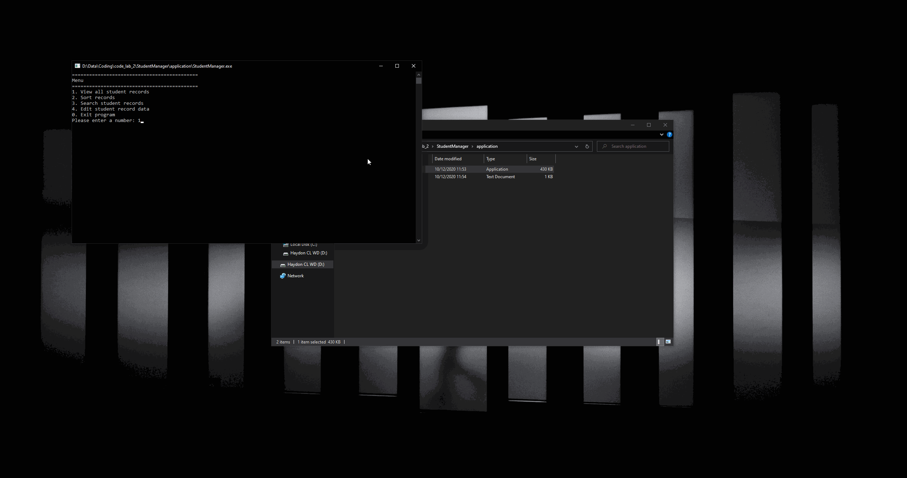

# StudentManager

Software for the management of student informational records. Allowing viewing, editing, adding and deleting of student information to a database stored in a txt file. Representing purposeful user interaction and handling.

### Screen Capture

To run this application simply download and find the .exe in the "application folder", double click this and start using the vending machine.
